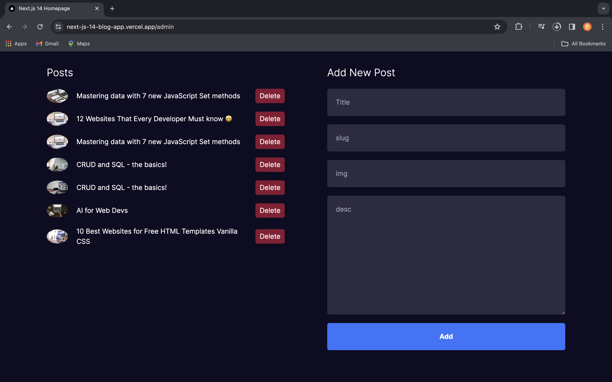
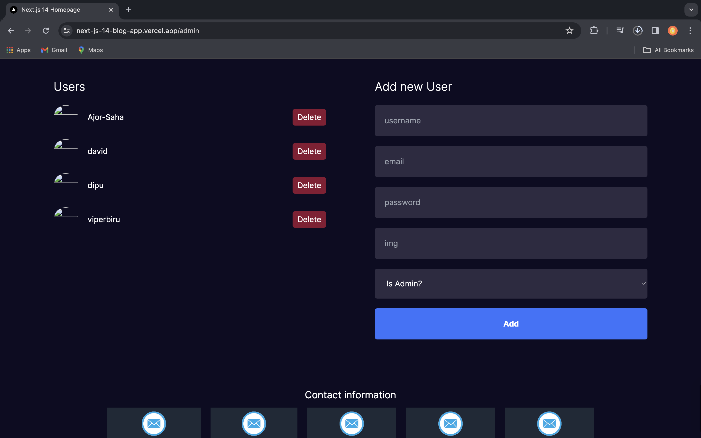
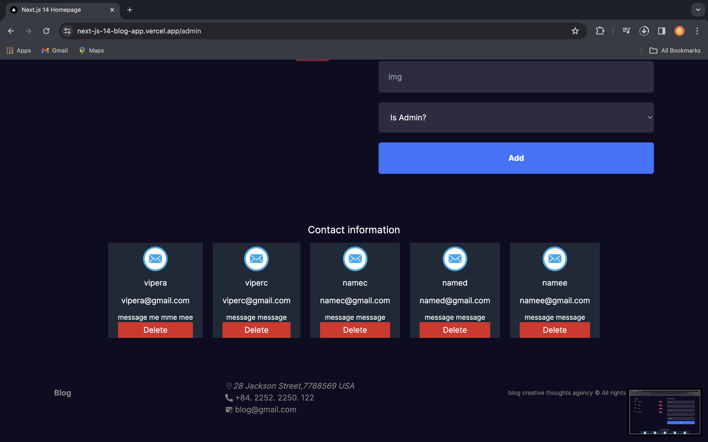

You can view the site here
[Click Me](https://next-js-14-blog-app.vercel.app/)

# My Awesome Blog Web App

Welcome to my awesome Next.js full-stack blog web app! This app allows users to browse blogs, read them, and engage with the content. It includes user authentication, GitHub authentication, admin dashboards, blog creation and deletion, user management, and a contact form for users to connect with the admin.

## Features

- **User Authentication:** Users can register, login, and authenticate using NextAuth.js.
- **GitHub Authentication:** GitHub users can seamlessly authenticate to the app.
- **Admin Dashboards:** Admins can create and delete blog posts, manage users, and access contact information.
- **Blog Management:** Users can browse blogs, read them, and admins can create and delete blog posts.
- **Contact Form:** Users can contact the admin via a contact form.

## Tech Stack

- **Frontend:** Next.js, React
- **Backend:** MongoDB, NextAuth.js
- **Authentication:** NextAuth.js, GitHub OAuth
- **Styling:** CSS

## Getting Started

1. Make sure **Git** and **NodeJS** is installed.
2. Clone this repository to your local computer.
3. Create MongoDB Database. `MONGO` is the connection URL for your MongoDB Database
4. Create `.env` file in root directory.
5. Contents of `.env`:
    For the project to work correctly, you will need to configure the following environment variables:

    GITHUB_ID: Your GitHub client ID.
    GITHUB_SECRET: Your GitHub client secret.
    MONGO: The URL of your MongoDB database.

```bash
# MONGO = 

# NEXTAUTH_URL = http://localhost:3000/api/auth
# NEXTAUTH_SECRET = 

# GITHUB_ID = 
# GITHUB_SECRET = 
```
6. Open terminal in root directory. Run npm install or yarn install.
7. Now app is fully configured 👍 and you can start using this app using npm run dev or yarn dev.

## Admin Dashboard Screenshots

<h3>Add post</h3>



<h3>Add user</h3>


<h3>Add user</h3>
